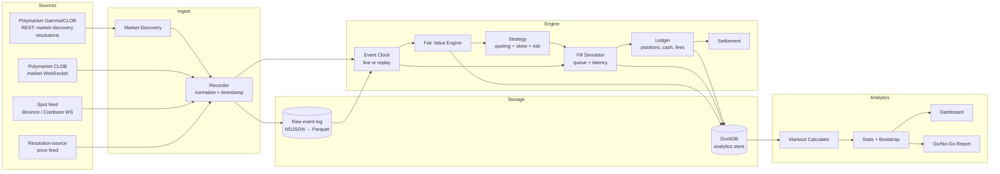
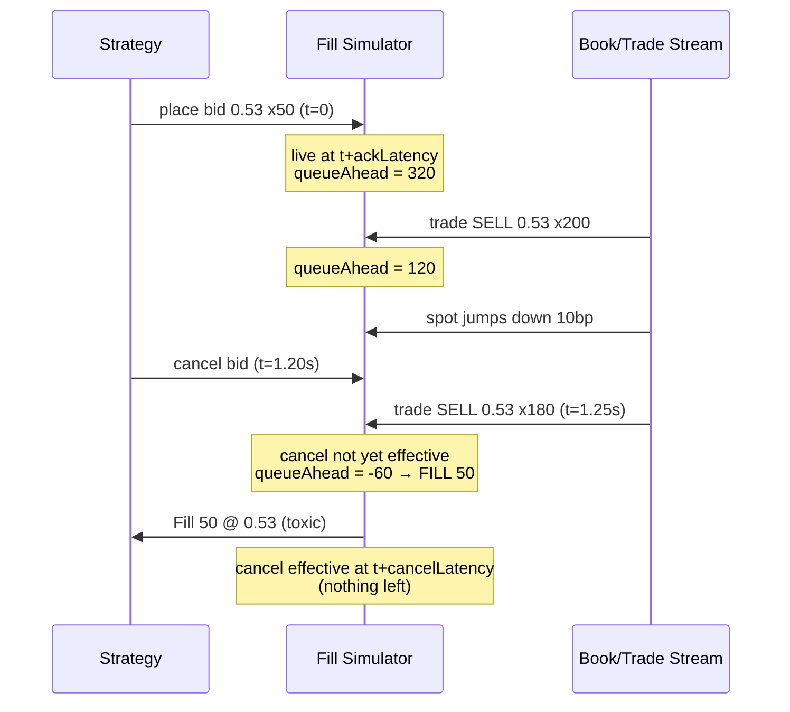
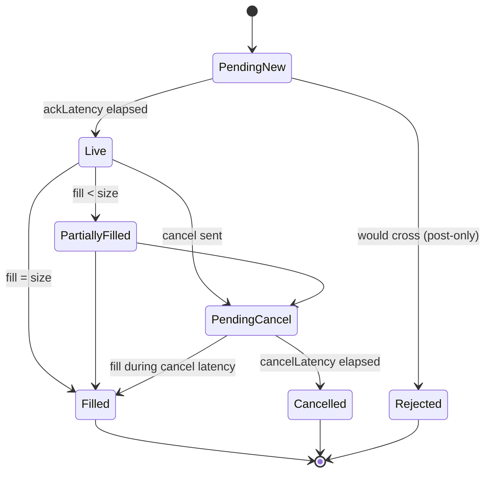
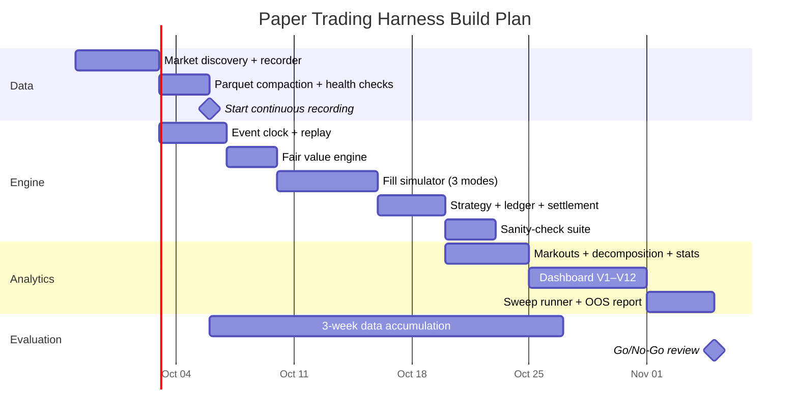

# Design Doc: Paper Trading Harness for Polymarket 15-Minute BTC Market Making

**Project Name** RainTrade
**Status:** Draft v1
**Scope:** Simulated (no real orders) market making on Polymarket "Bitcoin Up or Down — 15 min" markets, with a recorder, replay engine, fill simulator, and an analytics dashboard built to answer one question:

> **After realistic fills, fees, rebates, and adverse selection, does this strategy have a statistically credible positive edge?**

---

## 1. Goals and Non-Goals

### Goals
1. **Record** every relevant market event (Polymarket order books, trades, spot price, resolutions) to disk, losslessly and with timestamps.
2. **Simulate** a market-making strategy against live or recorded data with a realistic, *configurable-pessimism* fill model (queue position + latency).
3. **Decompose PnL** into spread capture, adverse selection, inventory/settlement, fees, and rebates, so you know *why* you made or lost money.
4. **Quantify uncertainty**: confidence intervals, not just point estimates.
5. **Replay deterministically** so parameter sweeps run on identical data.
6. Produce a **go/no-go report** for live trading.

### Non-Goals
- Sending real orders (the order-placement adapter is a stub interface only).
- Sub-millisecond latency optimization.
- Markets other than BTC 15-minute (design keeps coin/timeframe as parameters so ETH/SOL/XRP and 5-min can be added later).

---

## 2. System Architecture



**Key principle:** the engine never talks to a feed directly. It consumes a single ordered stream of `MarketEvent`s from the **Event Clock**, which is fed either by the live recorder or by a file replay. Live paper trading and backtesting are therefore the same code path.

---

## 3. Data Sources

| Source | What we take | Why |
|---|---|---|
| Polymarket market discovery (REST) | Market IDs, Up/Down token IDs, window start/end, resolution source | Know which 15-min market is live and when it closes |
| Polymarket market WebSocket | Book snapshots, price-level changes, last-trade events for **both** Up and Down tokens | Order book state and trade flow for fill simulation |
| Spot exchange WebSocket | Best bid/ask + trades for BTC-USD(T), ms timestamps | Drives fair value; fast signal that adverse flow reacts to |
| Resolution-source price | The exact price series the market resolves against | Opening price S₀ and ground-truth settlement |
| Polymarket resolution (REST) | Official outcome per market | Cross-check our computed settlement |

> ⚠️ **Verify before building:** (a) the exact resolution source and how the opening/closing price is sampled, (b) whether the published book for one token already reflects complementary-token liquidity, (c) current taker-fee formula and rebate rules. All three are configurable, not hard-coded.

---

## 4. Components

### 4.1 Market Discovery
- Polls every 30 s; pre-registers the *next* market ≥ 60 s before open.
- Emits `MarketOpened` / `MarketClosed` events with token IDs and S₀ once known.

### 4.2 Recorder
- Normalizes all feeds into `MarketEvent` (schema §6), stamping both `exchangeTs` (from source) and `recvTs` (local monotonic clock, ns).
- Writes append-only NDJSON, rotated hourly, compacted to Parquet nightly.
- Tracks feed health: gaps, reconnects, sequence breaks → `FeedGap` events. Any market with a gap > N ms is flagged and excluded from headline stats (but kept for robustness analysis).

### 4.3 Fair Value Engine
Driftless digital-option approximation:

$$
P(\text{Up}) = \Phi\!\left(\frac{\ln(S_t / S_0)}{\sigma \sqrt{\tau}}\right)
$$

- `S_t`: spot mid (or resolution-source price, configurable)
- `S_0`: window opening price from resolution source
- `τ`: seconds remaining / seconds per year-equivalent unit consistent with σ
- `σ`: realized vol, EWMA of 1-s log returns (half-life configurable, e.g. 60 s and 600 s blended)

Outputs `FairValue { ts, p, sigma, tau }` on every spot tick. Logged for calibration analysis (§7.5).

### 4.4 Strategy (Market Maker)
Parameters (all sweepable):

| Param | Meaning | Example |
|---|---|---|
| `halfSpread` | Distance of quotes from FV, in cents | 1.0¢ |
| `volSpreadMult` | Extra half-spread per unit σ√τ | 0.5 |
| `skewPerShare` | Quote shift per share of inventory | 0.01¢ |
| `maxInventory` | Hard cap on net Up-equivalent shares | 500 |
| `quoteSize` | Shares per quote | 50 |
| `requoteThreshold` | Min FV move before cancel/replace | 0.3¢ |
| `pullBeforeClose` | Stop quoting N seconds before close | 60 s |
| `pullOnSpotJump` | Cancel all if spot moves > X bp in < Y ms | 8 bp / 500 ms |

Quote logic per tick:

```
fv       = fairValue.p
hs       = halfSpread + volSpreadMult * sigma * sqrt(tau)
skew     = skewPerShare * netInventory        // long Up → shift down
bid      = round_down(fv - hs - skew, tick)
ask      = round_up(fv + hs - skew, tick)
if |inventory| >= maxInventory: suppress the side that adds risk
if tau < pullBeforeClose or spotJumpDetected: cancel all
post-only: never cross the book
```

Net inventory is measured in **Up-equivalent shares**: long 1 Up = +1, long 1 Down = −1.

### 4.5 Fill Simulator (the most important component)

Paper-trading results are only as good as the fill model. The simulator tracks **queue position** and **latency**, and runs in three modes simultaneously so you always see a range:

| Mode | Queue on arrival | Cancels ahead of us | Latency |
|---|---|---|---|
| **Optimistic** | Visible size at level | Pro-rata reduce queue | Low (e.g. 50 ms) |
| **Base** | Visible size at level | 50% of cancels from ahead | Medium (e.g. 150 ms) |
| **Pessimistic** | Visible size at level + 10% | No reduction (cancels assumed behind us) | High (e.g. 400 ms) |

**Decisions are made on Pessimistic mode.** If the edge only exists in Optimistic, it doesn't exist.

Rules:
1. **Placement latency:** an order becomes live at `t + ackLatency`. Its initial `queueAhead` = displayed size at that price level at that moment.
2. **Cancel latency:** a cancel takes effect at `t + cancelLatency`. Trades during that window **can still fill you**. This is where adverse selection shows up, so this rule must never be skipped.
3. **Trade at our level:** `queueAhead -= tradeSize`; if it goes negative, fill `min(-queueAhead, remaining)`.
4. **Trade through our level** (e.g. sell prints below our bid): fill fully.
5. **Post-only:** if our price would cross on arrival, the order is rejected (logged as `RejectedCross`).
6. **Complementary matching:** a trade in Down at price *q* is treated as liquidity against Up at *1 − q* only if §3(b) confirms that's how the book behaves. Flag in config.
7. **Our size does not move the market** (assumption; valid only while `quoteSize` ≪ typical level size, checked in §8).



Order lifecycle:



### 4.6 Ledger and Settlement
- Tracks cash (USDC), Up shares, Down shares per market.
- **Merge:** matched Up + Down pairs are converted to $1 each (configurable on/off, since in reality merges cost gas/time).
- **Fees:** maker fee = 0; taker fee function pluggable (only matters if you later add taker hedges).
- **Rebates:** modeled as `rebatePool(market) × ourShareOfFilledMakerLiquidity`. Since the true pool depends on everyone's taker fees, estimate it from recorded taker volume × fee formula. Reported **separately** from trading PnL so you can see whether the strategy stands on its own.
- **Settlement:** at close, Up pays 1 if `S_close > S_0` (check tie rule), else 0. Cross-check against the official resolution; mismatches are logged as `SettlementMismatch` and investigated.

### 4.7 Replay Engine
- Reads recorded Parquet in timestamp order, merges sources by `recvTs` (what you'd actually have seen live).
- Deterministic: same data + same config = identical output (seeded RNG for any randomness).
- Supports **parameter sweeps**: runs N configs in parallel over the same event stream.

---

## 5. Tech Stack

| Layer | Choice | Reason |
|---|---|---|
| Engine, recorder | TypeScript on Node (single process, event loop) | Fits an existing TS monorepo; WS-heavy I/O |
| Raw storage | NDJSON → Parquet | Cheap append; columnar for analytics |
| Analytics store | DuckDB | Fast SQL over Parquet, no server |
| Stats | TypeScript for live metrics; Python/Polars notebook optional for deep dives | Bootstrap + regression are easier in Python |
| Dashboard | React + Recharts (or Observable Plot), reading DuckDB via a small API | Interactive drill-down per market |
| Config | YAML + zod validation | Sweepable, versioned |

Monorepo layout:

```
packages/
  pm-harness-core/      # types, event clock, ledger
  pm-harness-feeds/     # polymarket, spot, resolution adapters
  pm-harness-sim/       # fill simulator, fee/rebate models
  pm-harness-strategy/  # fair value + market maker
  pm-harness-analytics/ # markouts, stats, report generator
apps/
  harness-live/         # live paper trading runner
  harness-replay/       # backtest + sweep CLI
  harness-dashboard/    # web UI
```

---

## 6. Data Schemas

```ts
type Side = "BUY" | "SELL";
type Token = "UP" | "DOWN";
type FillMode = "optimistic" | "base" | "pessimistic";

interface MarketEvent {
  kind: "book_snapshot" | "book_delta" | "trade" | "spot" | "res_price"
      | "market_open" | "market_close" | "resolution" | "feed_gap";
  marketId?: string;
  token?: Token;
  exchangeTs: number;   // ms from source
  recvTs: bigint;       // ns local monotonic
  payload: unknown;     // kind-specific, validated by zod
}

interface SimOrder {
  orderId: string;
  runId: string;
  mode: FillMode;
  marketId: string;
  token: Token;
  side: Side;
  price: number;        // 0..1, tick-aligned
  size: number;
  placedTs: number;
  liveTs?: number;
  cancelReqTs?: number;
  doneTs?: number;
  status: "PendingNew" | "Live" | "PartiallyFilled" | "PendingCancel"
        | "Filled" | "Cancelled" | "Rejected";
  queueAheadAtLive?: number;
}

interface SimFill {
  fillId: string;
  orderId: string;
  runId: string;
  mode: FillMode;
  marketId: string;
  token: Token;
  side: Side;
  price: number;
  size: number;
  ts: number;
  secondsToClose: number;
  fvAtFill: number;          // Up-probability at fill time
  sigmaAtFill: number;
  inventoryBefore: number;   // Up-equivalent
  duringCancelLatency: boolean;
}

interface MarketResult {
  runId: string;
  mode: FillMode;
  marketId: string;
  windowStart: number;
  outcome: 0 | 1;            // Up won?
  pnlTrading: number;
  pnlSpread: number;
  pnlAdverse: number;
  pnlInventory: number;
  rebateEst: number;
  fees: number;
  volumeFilled: number;
  maxAbsInventory: number;
  quoteUptimePct: number;
  realizedVol: number;
  excluded: boolean;         // feed gap, settlement mismatch
}
```

---

## 7. Statistics and Metrics

### 7.1 PnL Decomposition (per fill, then summed)

Let `d = +1` for buying Up-equivalent and `−1` for selling, `p` = fill price in Up terms, `q` = size, `FV_t` = fair value at fill, `FV_{t+h}` = fair value `h` seconds later, `Y` = settlement (0/1). Then exactly:

$$
\underbrace{d(Y - p)q}_{\text{total}} =
\underbrace{d(FV_t - p)q}_{\text{spread capture}} +
\underbrace{d(FV_{t+h} - FV_t)q}_{\text{adverse selection}} +
\underbrace{d(Y - FV_{t+h})q}_{\text{inventory / settlement noise}}
$$

Default `h = 5 s`; also report `h ∈ {1, 5, 30, 60} s`.

- **Spread capture** should be positive by construction (you quote around FV).
- **Adverse selection** is usually negative. It is *the* number to watch.
- **Inventory** should average ≈ 0 if FV is well calibrated; its variance is your risk.

**Net edge per share** = (spread + adverse + inventory + rebates − fees) / shares filled.

### 7.2 Markout Curves
For each horizon `h` in {0.5, 1, 2, 5, 10, 30, 60, 120 s, settlement}:

$$
\text{markout}(h) = \frac{\sum d\,(FV_{t+h} - p)\,q}{\sum q}
$$

Shape interpretation: starts at +half-spread at h=0, dips as informed flow hits you. If it crosses below zero, you are being picked off faster than you earn.

### 7.3 Core Performance Stats

| Metric | Definition |
|---|---|
| Net PnL | Σ market PnL (trading + rebates − fees) |
| PnL per market | mean, median, sd, skew, 5th/95th pct |
| Edge (¢/share) | Net PnL / shares filled |
| Hit rate (markets) | % markets with PnL > 0 |
| Win/loss ratio | avg winning market / avg losing market |
| Sharpe (daily) | mean(daily PnL) / sd(daily PnL) × √365 |
| Max drawdown | peak-to-trough on cumulative PnL, $ and in markets |
| Time to recover | markets from DD trough to new high |
| Fill rate | filled size / quoted size |
| Quote uptime | % of eligible time with both sides live |
| Toxic-fill share | % of fills with 5 s markout < 0 |
| Cancel-latency fills | % of fills occurring during `PendingCancel` (key latency risk metric) |
| Inventory | mean \|inv\|, max \|inv\|, % time at cap |
| Capital used | max cash at risk (for return-on-capital) |

### 7.4 Uncertainty and Significance
Per-market PnL is the unit of observation (~96 per day).

- **t-stat:** `mean / (sd / √n)`. Require > 2.5 before trusting a positive mean.
- **Block bootstrap CI:** resample in blocks of 1 day (preserves intraday autocorrelation and vol regimes), 10,000 draws → 95% CI for mean PnL/market and edge ¢/share.
- **Probability of positive edge:** fraction of bootstrap draws > 0.
- **Minimum sample:** ≥ 2,000 non-excluded markets (~3 weeks) and ≥ 2 distinct volatility regimes.
- **Multiple-testing guard:** for parameter sweeps, hold out the last 30% of days. Pick parameters on the first 70%, then report *only* out-of-sample results for the chosen config. Also report how many configs were tried.

### 7.5 Fair Value Calibration
Your FV model drives everything, so test it directly:

- **Reliability diagram:** bucket FV predictions into 10 bins by value, plot mean predicted vs actual Up frequency at settlement. Separate panels for τ > 10 min, 5 to 10 min, < 5 min.
- **Brier score:** FV vs outcome, compared against **Polymarket mid** vs outcome. If the market mid beats your FV, the market knows more than your model.
- **Lead/lag:** cross-correlation of FV changes vs Polymarket mid changes. Positive lead = your FV moves first (good).

### 7.6 Breakdowns (every metric above, sliced by)
- Minute within window (0 to 14)
- FV bucket (0 to 0.1, …, 0.9 to 1.0)
- Realized-vol tercile (low/med/high)
- Hour of day UTC
- Side (bid vs ask fills) and inventory state (flat / long / short)
- Fill mode (optimistic / base / pessimistic)

---

## 8. Visuals

Every chart has a single question it answers.

| # | Chart | Question it answers |
|---|---|---|
| V1 | **Cumulative PnL, stacked decomposition** (spread, adverse, inventory, rebates) over time, with pessimistic/base/optimistic bands | Is it making money, and from what? |
| V2 | **Markout curve** (x: horizon log-scale, y: ¢/share), one line per fill mode, 95% CI shading | How fast am I being picked off? |
| V3 | **Per-market PnL histogram** with mean, median, and bootstrap CI marked | Is the edge a few lucky markets or broad? |
| V4 | **Drawdown underwater chart** | How much pain before recovery? |
| V5 | **Heatmap: minute-in-window × FV bucket → edge ¢/share** | Where in the window/probability range do I lose? |
| V6 | **Heatmap: vol tercile × hour UTC → PnL/market** | Which regimes/sessions to avoid? |
| V7 | **Inventory path** for a selected market, overlaid on FV, Polymarket mid, and our quotes, with fills marked (green = good markout, red = toxic) | What actually happened in this market? (drill-down) |
| V8 | **Reliability diagram** (FV and Polymarket mid vs outcome) | Is my fair value calibrated, and better than the market? |
| V9 | **Scatter: spot move in prior 1 s vs 5 s markout**, per fill | Are toxic fills explained by spot jumps (→ fix pull logic)? |
| V10 | **Parameter sweep heatmap: halfSpread × skewPerShare → out-of-sample edge**, with t-stat annotations | Which parameters are robust (plateau) vs overfit (spike)? |
| V11 | **Bootstrap distribution** of mean PnL/market | How confident am I that edge > 0? |
| V12 | **Fill-mode comparison bar**: net edge under each mode | Does the edge survive pessimistic fills? |

### Dashboard layout

```
┌──────────────────────────────────────────────────────────────────────┐
│ Run: mm-v3  Mode: [Pessimistic ▾]  Range: [Last 21 days ▾]  Coin: BTC│
├──────────────┬──────────────┬──────────────┬──────────────┬──────────┤
│ Net PnL      │ Edge ¢/share │ 95% CI       │ t-stat       │ Max DD   │
│ $+412        │ +0.18¢       │ [+0.02,+0.35]│ 2.7          │ -$96     │
├──────────────┴──────────────┴──────────────┴──────────────┴──────────┤
│ V1 Cumulative PnL (stacked decomposition + mode bands)               │
├───────────────────────────────────┬──────────────────────────────────┤
│ V2 Markout curve                  │ V3 Per-market PnL histogram      │
├───────────────────────────────────┼──────────────────────────────────┤
│ V5 Minute × FV heatmap            │ V8 Reliability diagram           │
├───────────────────────────────────┼──────────────────────────────────┤
│ V9 Spot-jump vs markout scatter   │ V4 Drawdown                      │
├───────────────────────────────────┴──────────────────────────────────┤
│ Market table (sortable): id | PnL | adverse | fills | max inv | flag │
│   → click row opens V7 drill-down                                    │
└──────────────────────────────────────────────────────────────────────┘
```
*(Numbers above are placeholders for layout only.)*

---

## 9. Validation and Sanity Checks

Automated checks that fail the run if violated:

1. **Decomposition identity:** spread + adverse + inventory = total trading PnL (to 1e-9).
2. **Zero-strategy test:** a strategy that never quotes has exactly zero PnL.
3. **Random-quote test:** quoting at random prices should show negative edge ≈ −(half-spread) after adverse selection. Positive = simulator bug.
4. **Perfect-foresight test:** a cheating strategy that knows `FV_{t+5s}` must show large positive adverse-selection PnL. Confirms markout sign conventions.
5. **Settlement cross-check:** computed outcome = official outcome for ≥ 99.9% of markets.
6. **Size impact check:** `quoteSize / median level size` < 0.2 in ≥ 95% of quotes; otherwise the "we don't move the market" assumption is flagged.
7. **Replay determinism:** two runs on the same data produce byte-identical results.

**Sim-to-real gap (later phase):** when you go live with tiny size, run the simulator in parallel on the same period and compare simulated vs actual fills, fill rate, and markouts. Recalibrate latency/queue parameters until Base mode matches reality.

---

## 10. Go / No-Go Criteria for Live Trading

All must hold, **in Pessimistic fill mode, on out-of-sample data**:

| Criterion | Threshold |
|---|---|
| Sample size | ≥ 2,000 non-excluded markets, ≥ 3 weeks |
| Net edge (excl. rebates) | 95% CI lower bound ≥ 0 |
| Net edge (incl. rebates) | 95% CI lower bound > 0, t-stat ≥ 2.5 |
| Regime robustness | Mean PnL/market ≥ 0 in each vol tercile, or a tested rule that stops quoting in the bad one |
| Drawdown | Max DD < 20% of planned bankroll |
| Parameter robustness | Chosen config sits on a plateau in V10 (neighbours within 30% of its edge) |
| FV calibration | Brier score not worse than Polymarket mid by > 1% |

If it passes, go live at ~5 to 10% of simulated size and run the sim-to-real comparison (§9) for 2 weeks before scaling.

---

## 11. Milestones



Start recording as early as possible: the data accumulation is the longest pole, and it runs in parallel with everything else.

---

## 12. Risks and Open Questions

| Risk / Question | Impact | Mitigation |
|---|---|---|
| Queue model is wrong (hidden priority, cross-token matching) | Fills too optimistic → false edge | Three fill modes; decide on pessimistic; sim-to-real calibration |
| Our real latency is worse than modeled | Adverse selection understated | Measure real WS round-trip early; sweep latency in replay |
| Rebate estimate is off | Edge incl. rebates overstated | Report edge excl. rebates as primary gate |
| Resolution-source mismatch (different price than our spot) | FV biased near S₀ | Use resolution-source feed for S₀ and settlement; spot only for fast signal |
| Regime change (volatility, new competitors, fee changes) | Past edge disappears | Rolling 7-day edge monitor; kill switch in live |
| Overfitting via sweeps | False edge | Holdout split, report configs tried, prefer plateaus |
| Feed gaps during volatile periods | Survivorship bias if excluded | Report stats with and without excluded markets |
